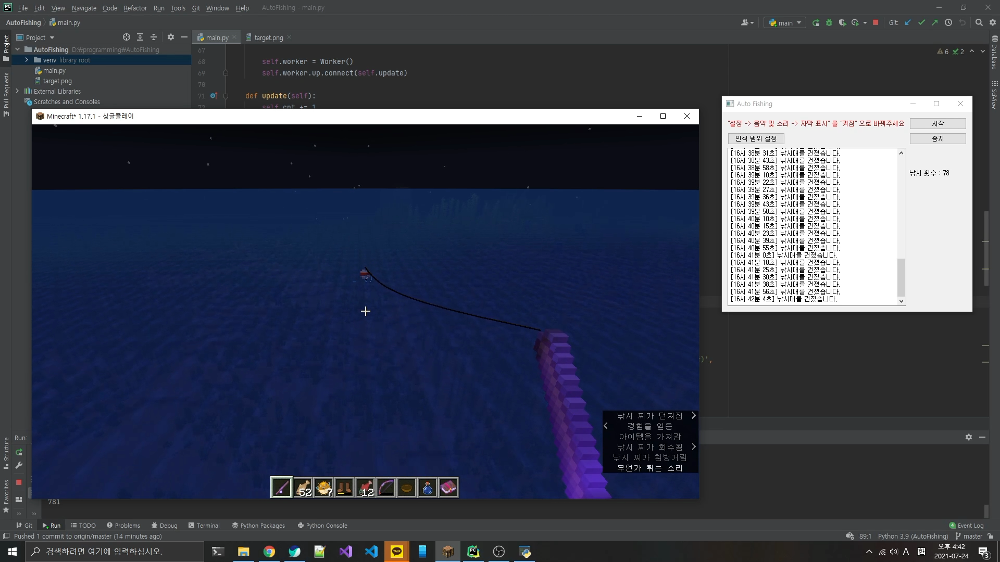
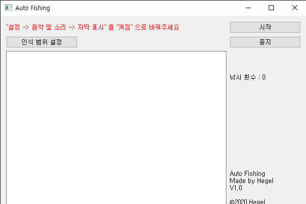

# AutoFishing
마인크래프트 자동 낚시 프로그램

-------------------
### 사용법
#### 1. 인식 범위 설정

 - 인식 범위 설정 버튼을 누르고, 자막이 표시되는 곳의 왼쪽 위, 오른쪽 아래를 각각 선택
 - 왼쪽 위는 게임창 안에 위치해야 함
 - 범위가 넓으면 렉이 유발될 수 있음
#### 2. 시작
 - 시작 버튼을 누르면 3초 후부터 자동으로 낚시를 시작합니다.
#### 3. 정지
 - 정지 버튼은 작동하지 않습니다.(?)
 - 창을 닫으시면 알아서 프로그램이 종료됩니다.